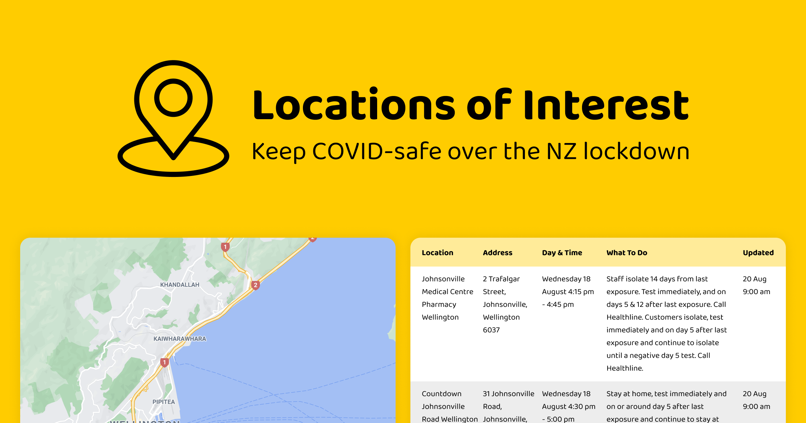

# Locations of Interest

## About

[www.locationsofinterest.co.nz](https://locationsofinterest.co.nz/?ref=github.readme)



During Level 4 lockdown, we started this project to build something that would be useful to ourselves and many others and plug a gap in our COVID-19 response. We found it difficult to find relevant locations of interest in the collection of hundreds. We could search, but as Wellingtonians we often got tired of sifting through "Mount Wellington" locations.

Locations of Interest is a site aimed to help you find the important COVID exposure information you need to know, faster.

Using the Ministry of Health's locations of interest data, this tool allows you to better search, filter and sort for what's relevant to you, all neatly tied into a side-by-side map and table view.

The site automatically updates with new locations of interest data from a GitHub repo maintained and updated by the Ministry of Health.

This project is made by two local Wellington software developers and is not affiliated with the Ministry of Health or Unite Against COVID - just a fun project to help our fellow Kiwis. 💛

## Development

### Dependencies

- Node.js 15.8+

### Installation

First, install any package dependencies:

```bash
npm i
```

To start the local development server:

```bash
npm start
```

### Build

```bash
npm run build
```
